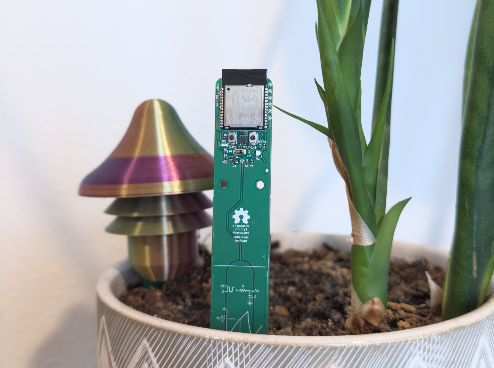
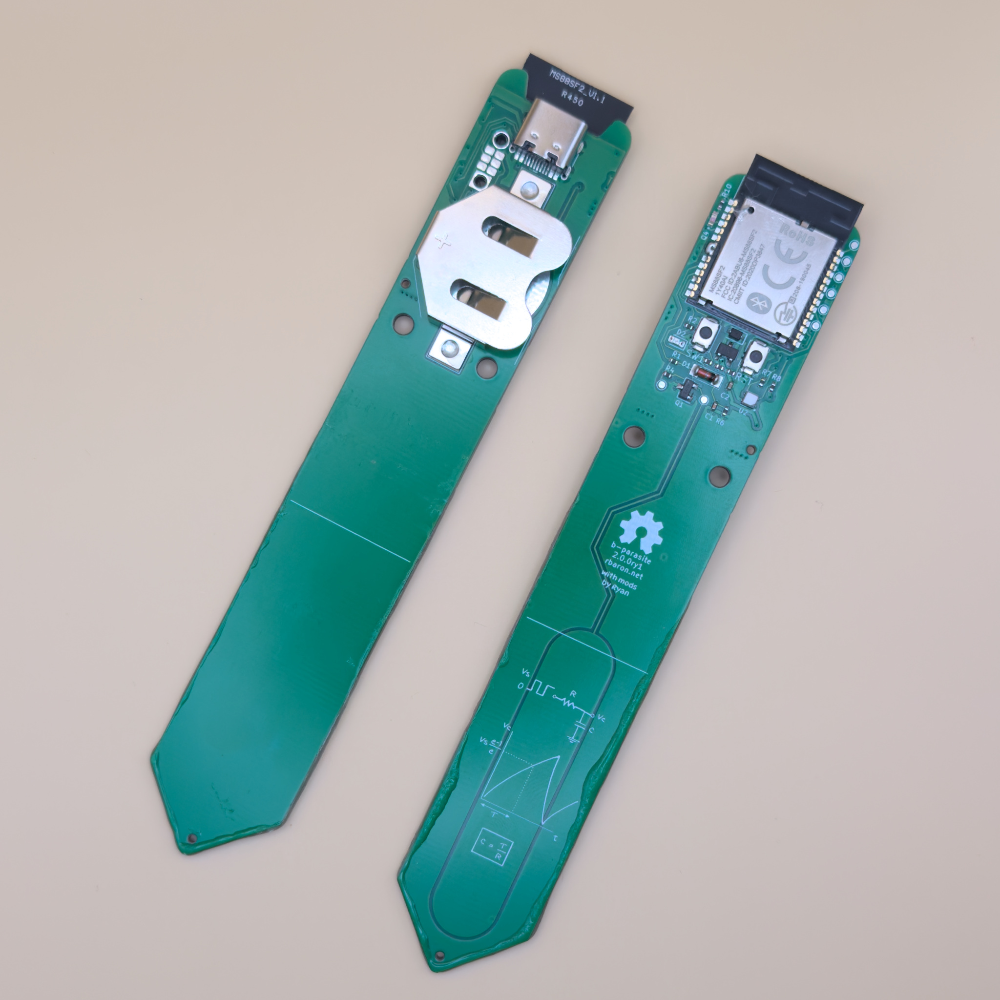
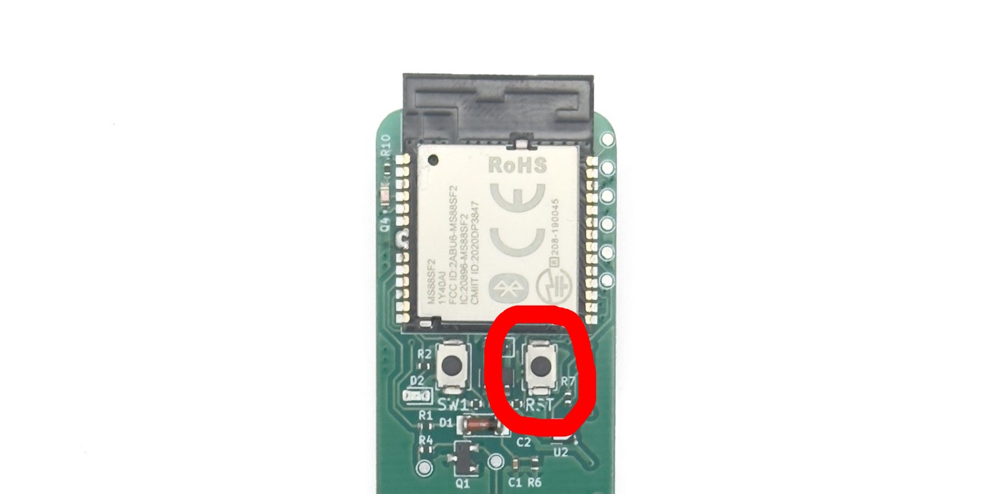

# b-parasite

   
  <i>This image is just for showing off the full PCB. The sensor must be pushed down to the horizontal white line to work properly.</i>

This is my fork of [b-parasite](https://github.com/rbaron/b-parasite), an open source soil moisture and ambient temperature/humidity/light sensor. Notable changes are:
- I changed the bluetooth module to MinewSemi nrf52840-MS88SF21. This is because it's
- I've added a USB-C connector, and the bluetooth module is programmed with the [Adafruit nRF52 bootloader](https://github.com/rianadon/Adafruit_nRF52_Bootloader). The module can now be powered by either the coin cell and/or USB. If both are plugged in, priority is given to USB. Do be careful to ground yourself before plugging in USB. There was not room for ESD diodes on the PCB.
- Instead of feeding the battery directly to the chip voltage, I utilize the internal LDO to step down the voltage. This has several benefits. Battery life is extended due to running the chip and wireless transmitter at lower voltage, wireless transmission is consistent regardless of battery voltage, and there is no need to calibrate across different voltages. Only 1 measurement each of wet/dry moisture and sun luminosity are required to calibrate the sensor.
- Utilizing a USB COM port, calibration can now easily be performed without any specialized hardware.
- I've changed a few components to what's in stock on LCSC. The most noticeable of these is I replaced the Sensirion SHTC3, which was not in stock at the time of ordering, with a cheap clone. It's accurate within a few degrees F.

  

Instead of version tags I publish the software binaries on every commit. Check the [releases](https://github.com/rianadon/b-parasite/releases) to grab your preferred UF2. There are binaries for both BLE and Zigbee. I've tested both; while BLE is supposedly the more stable one I've been using Zigbee without issues.

For building the firmware yourself or performing your own calibration, see [code/README.md](code/README.md). To upload code, plug the b-parasite into your computer with a usb-c cable and press the reset button (RST) two times in quick succession. The LED (D2) will start pulsing in and out.

    

**Errata:** On the PCB I accidentally routed the sensor to P0.26, which does not support analog input. Therefore I've solder bridged P0.26 to P0.04 and used P0.04 as the sensor pin in the code. If you are manufacturing the PCBs in my fork yourself, I suggest you edit the PCB to connect SENS_OUT to P0.04 so that the solder bridge is not required.

Speaking of building these yourself, the most economical option is to order the PCBs with only the top soldered then solder on the USB connector and coin cell holder yourself with a stencil.

The original README is below:

---------------

b-parasite is an open source soil moisture and ambient temperature/humidity/light sensor.

# Features
* Capacitive Soil moisture sensor - see [this blog post](https://rbaron.net/blog/2021/04/05/How-capacitive-soil-moisture-sensors-work.html), [this Twitter thread](https://twitter.com/rbaron_/status/1367182806368071685), and [this post](https://wemakethings.net/2012/09/26/capacitance_measurement/) for nice resources on how they work
* Air temperature and humidity sensor using a [Sensirion's SHTC3](https://www.sensirion.com/en/environmental-sensors/humidity-sensors/digital-humidity-sensor-shtc3-our-new-standard-for-consumer-electronics/)
* Light sensor using an [ALS-PT19](https://en.everlight.com/wp-content/plugins/ItemRelationship/product_files/pdf/ALS-PT19-315C-L177-TR8_V8.pdf) phototransistor
* Powered by a common CR2032 coin cell, potentially for over two years
* Support for [nRF52840](https://www.nordicsemi.com/products/nrf52840) and [nRF52833](https://www.nordicsemi.com/products/nrf52833) modules
* Open hardware and open source design

# Software
This repository also hosts a few different firmware samples for b-parasite.

|Sample|Description|Extra Documentation|
|---|---|---|
|[samples/ble](./code/samples/ble)|This is the most battle-tested and useful firmware. It periodically reads all sensors and broadcast them via Bluetooth Low Energy (BLE). It works with [Home Assistant](https://www.home-assistant.io/) + [BTHome](https://bthome.io/) out of the box. |[Docs](./code/samples/ble/README.md)|
|[samples/zigbee](./code/samples/zigbee)| An experimental/educational/exploratory basic Zigbee sample built on [nRF Connect + ZBOSS](https://developer.nordicsemi.com/nRF_Connect_SDK/doc/latest/nrf/ug_zigbee.html). It integrates with [Home Assistant](https://www.home-assistant.io/) via [ZHA](https://www.home-assistant.io/integrations/zha) or [Zigbee2MQTT](https://www.zigbee2mqtt.io/). |[Docs](./code/samples/zigbee/README.md)|
|[samples/blinky](./code/samples/blinky)| The classic "Hello, world" |-|
|[samples/soil-read-loop](./code/samples/soil-read-loop)| Reads the soil moisture sensor on a loop. Useful for experimenting and calibrating the sensor. |-|
|[samples/input](./code/samples/input)| Handles button presses. Useful for power profiling GPIO interrupts and testing debouncing for push switches on [boards that have them](https://github.com/rbaron/b-parasite/wiki/Hardware-Versions). |-|

# Documentation
Information about how to order, assemble, build the samples, protect the sensor and flash the firmware is on [the Wiki](https://github.com/rbaron/b-parasite/wiki).

# Repository Organization
* [code/](./code/) - A [`west workspace`](https://docs.zephyrproject.org/latest/develop/west/workspaces.html) containing the common `prstlib` module library and samples, built with Nordic's [nRF Connect SDK](https://www.nordicsemi.com/Products/Development-software/nrf-connect-sdk).
* [kicad/](./kicad/) - KiCad schematic, layout and fabrication files for the printed circuit board (PCB)
* [data/](data/) - data for testing and sensor calibration
* [bridge/](bridge/) - an [ESPHome](https://github.com/esphome/esphome)-based BLE-MQTT bridge
* [case/](case/) - a 3D printable case

  

# Case

  

We have three different 3D-printable cases:
1. Original snap-on case - [case/Top.stl](./case/Top.stl), [case/Bottom.stl](./case/Bottom.stl)
2. High airflow - [case/b_parasite_case_high_airflow.stl](./case/b_parasite_case_high_airflow.stl)
3. Mushroom-style - available on [Printables](https://www.printables.com/model/456571-mushroomcap-for-b-parasite-soil-moisture-sensor)
4. b-parasite Hat - available on [Printables](https://www.printables.com/model/901220-waterproof-case-for-b-parasite-soil-moisture-air-s)

# Accessories

Designs and hardware to help you, when building your own:
1. Desk holder for b-parasites [Printables](https://www.printables.com/de/model/566974-b-parasite-holder)

# License
The hardware and associated design files are released under the [Creative Commons CC BY-SA 4.0 license](https://creativecommons.org/licenses/by-sa/4.0/).
The code is released under the [MIT license](https://opensource.org/licenses/MIT).
