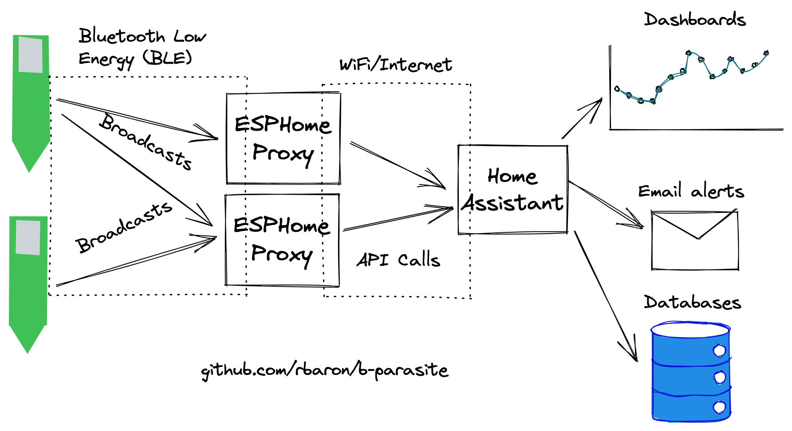
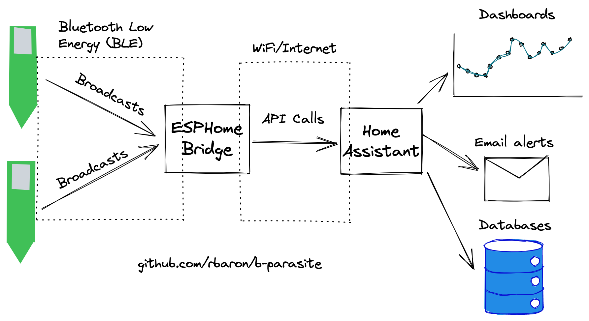
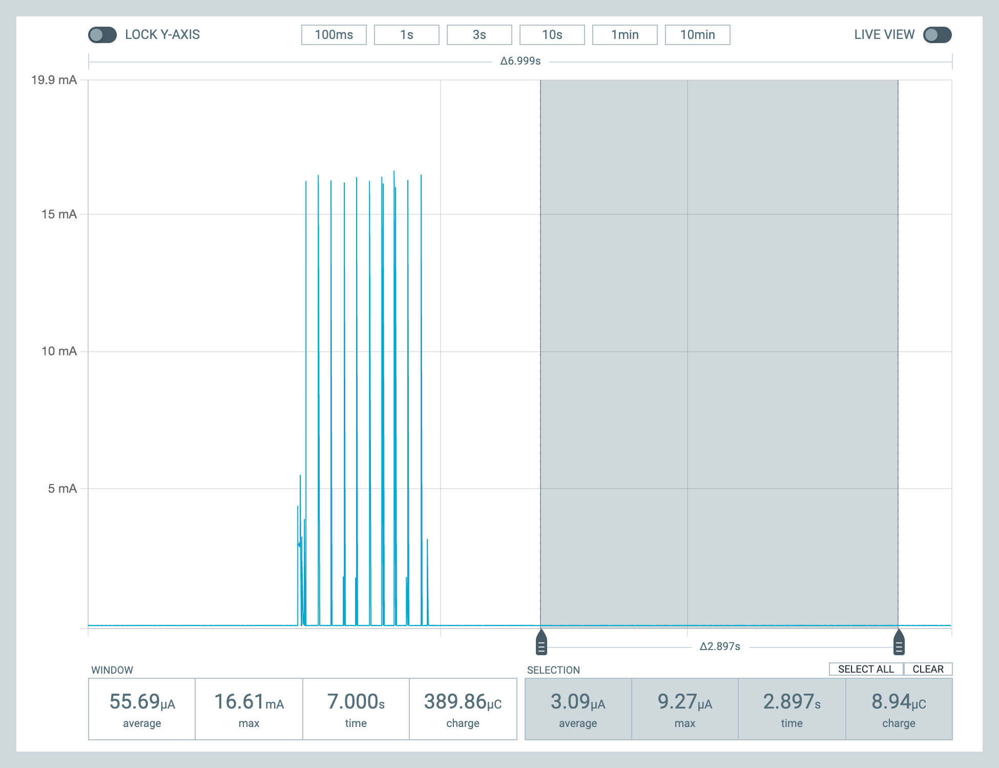
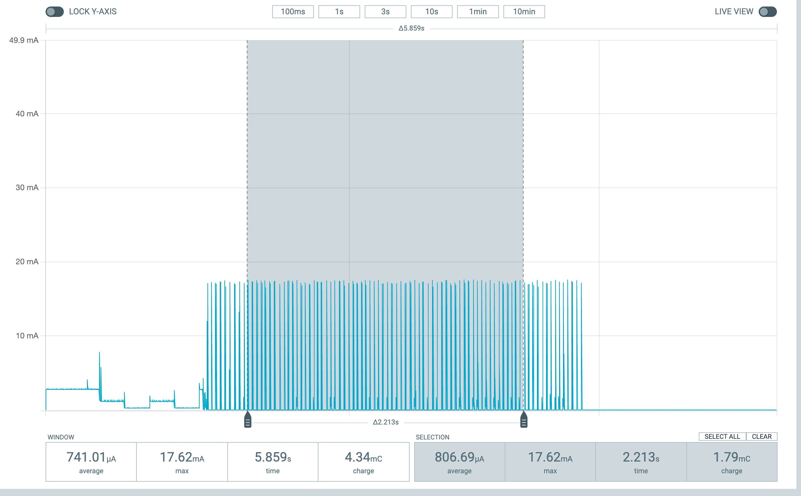
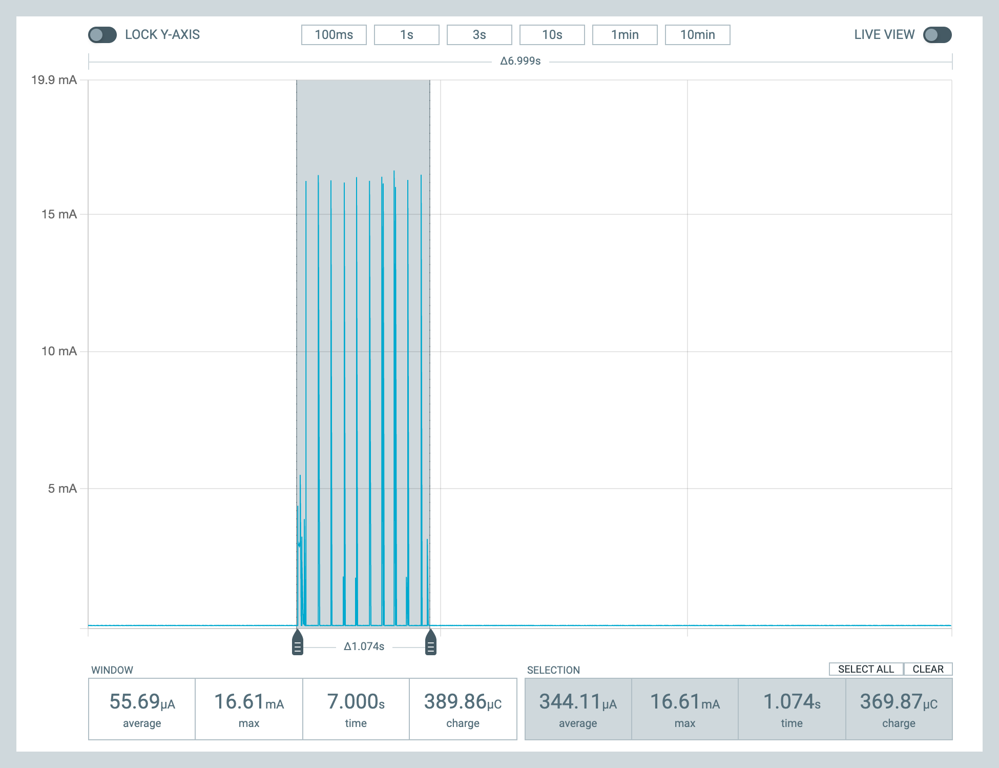

# Bluetooth Low Energy (BLE)
In this sample, b-parasite sensors are periodically read and broadcast using Bluetooth Low Energy (BLE) dvertising packets.

## Configuration
Available configurations and their default values are in [`Kconfig`](./Kconfig). They are set in [`prj.conf`](./prj.conf). Here are some notable examples.

### Sleep Interval
To save energy, the board spends most of the time in a "deep sleep" state, in which most peripherals and radio are completely turned off. The period of sleep is controlled by the `PRST_SLEEP_DURATION_SEC` config.

### Advertising Duration
When it wakes up, the sample reads all sensors and keep broadcasting advertising packets for `PRST_BLE_ADV_DURATION_MSEC` before going back to sleep.

### Advertising Packet Encoding
There are different ways to encode the sensor data in a BLE advertising packet.

#### BTHome Encoding
[BTHome](https://bthome.io) is a new (as of Dec/2022) open standard for encoding sensor data in BLE applications. [Home Assistant](https://www.home-assistant.io/integrations/bthome/) supports it out of the box. This makes the deployment extra convenient, since no additional configuration is needed - Home Assistant will automatically detect b-parasites in range.

What's even more interesting is that by employing [ESPHome](https://esphome.io/) bridges with the [`bluetooth_proxy`](https://esphome.io/components/bluetooth_proxy.html) component, the range of BLE coverage can be transparently increased. Multiple ESPHome bridges will forward received BLE broadcasts to Home Assistant.

This is what a typical deployment with BTHome looks like:


There are two versions of BTHome encodings supported by this sample:
* `PRST_BLE_ENCODING_BTHOME_V2=y` (**default**) uses the [BTHome V2](https://bthome.io/format/), supported by Home Assistant since version `2022.12`
* `PRST_BLE_ENCODING_BTHOME_V1=y` uses the [legacy BTHome V1](https://bthome.io/v1/), which was briefly in use
#### b-parasite Encoding
`PRST_BLE_ENCODING_BPARASITE_V2=y` selects the legacy encoding, used historically in this project. This is the encoding that the [`b_parasite`](https://esphome.io/components/sensor/b_parasite.html) ESPHome component understands.

With this encoding and a ESPHome + `b_parasite` component, this is an usual deployment topology:



The disadvantages of this encoding are:
- Each b-parasite has to be configured in the ESPHome component
- Range is limited, unless multiple ESPHome bridges are deployed with the same static configuration

## Building

The build script lives at [`code/scripts/build.sh`](../../scripts/build.sh) and runs inside the same Zephyr CI container that GitHub Actions uses. A wrapper at [`code/scripts/build-with-docker.sh`](../../scripts/build-with-docker.sh) handles the container — replace `docker` with `podman` if that's what you have, or `alias docker=podman` first.

```
usage: build.sh <sample> [soc] [revision] [--uf2] [--dev]
```

### Selecting the regulated VDD (`REGOUT0`)

On board revision `2.0.0ry1` the CR2032 is wired to `VDDH` and `VDD` is the regulated output of the chip's internal LDO/DC-DC. `UICR.REGOUT0` sets the output voltage. The firmware reads `CONFIG_BPARASITE_REGOUT0_*` at boot, programs UICR if it doesn't match, and resets — so the choice baked into your UF2 *is* the chip's runtime VDD.

Pick one (applies to both production and development builds, pass via `-DCONFIG_BPARASITE_REGOUT0_*V*=y`):

| Kconfig | VDD | BLE TX cap | Best for | CR2032 life (realistic) |
|---|---|---|---|---|
| `REGOUT0_DEFAULT` | 1.8 V (chip default) | 0 dBm | LED-less / IR LED only | ~3.5 yr |
| **`REGOUT0_2V1`** | **2.1 V** | **0 dBm** | **indoor planter, red LED at Vf ≤ 1.95 V — recommended default** | **~2.5–3.7 yr** |
| `REGOUT0_2V4` | 2.4 V | +4 dBm | balanced indoor/outdoor, more BLE range, cold-weather LED headroom | ~2.0–3.0 yr |
| `REGOUT0_2V7` | 2.7 V | +4 dBm | needs full BLE +4 dBm, low headroom on CR2032 — regulator dropouts when battery < 2.85 V | ~1.5–2.0 yr |
| `REGOUT0_3V0` | 3.0 V | +8 dBm | **USB / boosted VDDH only** — regulator dropouts immediately on CR2032 | n/a on CR2032 |
| `REGOUT0_3V3` | 3.3 V | +8 dBm | **USB / boosted VDDH only** | n/a on CR2032 |

The choice also drives `CONFIG_PRSTLIB_RADIO_TX_PWR_DBM` (an int — 0, 4, or 8 dBm — single source of truth used by both BLE and zigbee), which in turn sets the `CONFIG_BT_CTLR_TX_PWR_*` choice. See [`prstlib/boards/bparasite/Kconfig.defconfig`](../../prstlib/boards/bparasite/Kconfig.defconfig). To override TX power without changing REGOUT0, pass `-DCONFIG_PRSTLIB_RADIO_TX_PWR_DBM=N`. Also auto-configured: `CONFIG_PRSTLIB_BATT_VOLTAGE_DIVIDER` (× 5 when sampling VDDH/5 for battery, automatic for any non-DEFAULT choice).

#### Why not just stay at 3.3 V?

A CR2032 sits at ~3.0 V open-circuit and sags to ~2.7–2.85 V under TX-pulse load. The internal regulator needs ~150 mV of headroom — so anything ≥ 2.7 V dropouts under load and the chip effectively runs *unregulated* at the battery voltage, which (a) wastes the DC-DC step-down efficiency win, (b) gives sliding TX power as the battery droops, (c) makes ADC readings drift with V_bat. **2.1 V is the right answer for a CR2032 sensor that lives near a Home Assistant gateway.**

#### Required hardware

The chip enters high-voltage mode (where `REGOUT0` matters) only when `VDDH > VDD`. If your schematic has `VDD` and `VDDH` tied together (or both wired to the battery), `MAINREGSTATUS == NORMAL`, the firmware short-circuits, and you see V_bat on VDD regardless of UICR. The 2.0.0ry1 board layout assumes:

- `VDDH` ← CR2032 (+) + decoupling caps
- `VDD` ← decoupling cap to GND only
- `DEC4` ← inductor + cap (for DC-DC mode)

If you've measured 2.97 V on VDD running on battery and a UF2 that should have written `REGOUT0=2.1`, the schematic is the culprit. See [`prstlib/src/board_regout0.c`](../../prstlib/src/board_regout0.c) for the boot-time hook that gates on `MAINREGSTATUS`.

### Production build (deploy to battery)

Default `prj.conf` settings: 10-min wake cadence, 1-s advertise window, no USB stack, no logging. Pair with the `2.0.0ry1` board revision (CR2032 wired to VDDH) and pick a `REGOUT0` voltage that matches your hardware (see [`prstlib/boards/bparasite/Kconfig.regout0`](../../prstlib/boards/bparasite/Kconfig.regout0)).

```
./scripts/build-with-docker.sh ble nrf52840 2.0.0ry1 --uf2 \
  -DCONFIG_BPARASITE_REGOUT0_2V1=y
```

Output: `samples/ble/build_nrf52840_2.0.0ry1/ble/zephyr/zephyr.uf2` (~400 KB).

The `CONFIG_BPARASITE_REGOUT0_*` choice determines:
- `UICR.REGOUT0` programming at first boot (firmware reflashes the chip if VDD doesn't match) — see [`prstlib/src/board_regout0.c`](../../prstlib/src/board_regout0.c).
- Radio TX power (`PRSTLIB_RADIO_TX_PWR_DBM` defaults to 0 at 1.8–2.1 V, 4 at 2.4–2.7 V, 8 at 3.0–3.3 V; BLE picks its `BT_CTLR_TX_PWR_*` choice from this int, zigbee passes it to `zb_trans_set_tx_power()`).
- Battery ADC divider (`PRSTLIB_BATT_VOLTAGE_DIVIDER`) — set to 5 when the 2.0.0ry1 overlay samples `NRF_SAADC_VDDHDIV5`.

To flash: double-tap reset → drag the `.uf2` onto the `BPARASITE` USB drive.

### Development build (bring-up, sensor calibration, debugging)

Same command + `--dev`. This applies the shared [`dev`](../../prstlib/snippets/dev/) Zephyr snippet on top of `prj.conf`:

- USB CDC ACM virtual UART → console + log destination
- `CONFIG_LOG_DEFAULT_LEVEL=4` (verbose) + `CONFIG_PRSTLIB_LOG_LEVEL_DBG=y` (per-sensor debug logs)
- `CONFIG_PRST_SLEEP_DURATION_MSEC=5000` (advertise every ~6 s instead of every 10 min)

```
./scripts/build-with-docker.sh ble nrf52840 2.0.0ry1 --uf2 --dev \
  -DCONFIG_BPARASITE_REGOUT0_2V1=y
```

Output: `samples/ble/build_nrf52840_2.0.0ry1_dev/ble/zephyr/zephyr.uf2` (~445 KB).

The dev build lives in a separate build dir (`_dev` suffix), so dev and prod artifacts never overwrite each other.

After flashing, the board enumerates as a USB CDC ACM device (look for `/dev/cu.usbmodem*` on macOS, `/dev/ttyACM*` on Linux). Open it with any terminal: `screen /dev/cu.usbmodemXXXX 115200`.

Don't deploy a dev build to battery — USB and the 5-s loop drain a CR2032 in days, not years.

### Other targets

- `./scripts/build-with-docker.sh blinky nrf52840 2.0.0ry1 --uf2` — LED blink smoke test
- `./scripts/build-with-docker.sh input nrf52840 2.0.0ry1 --uf2` — button + LED test
- `./scripts/build-with-docker.sh soil-read-loop nrf52840 2.0.0ry1 --uf2` — analog chain debug (already configured for USB CDC logging by default)

## Battery Life
**tl;dr**: Theoretically well over two years with default settings.

While in deep sleep, the board consumes around `3.0 uA`:



In the active broadcasting state, the average power consumption is highly dependant on the advertising interval.

With the default settings (in the `[30, 40] ms` range), we see an average of around `810 uA`:



If for example we lower the connection interval to the SDK defaults (`[100, 150] ms`, roughly trading off range for power), the average current consumption is around `345 uA`:



With a `200 mAh` CR2032 battery, we can use [this spreadsheet](https://docs.google.com/spreadsheets/d/157JQiX20bGkTrlbvWbWRrs_WViL3MgVZffSCWRR7uAI/edit#gid=0) to estimate the battery life to over two years. Note that this is a simplified model and results in practice may vary.
