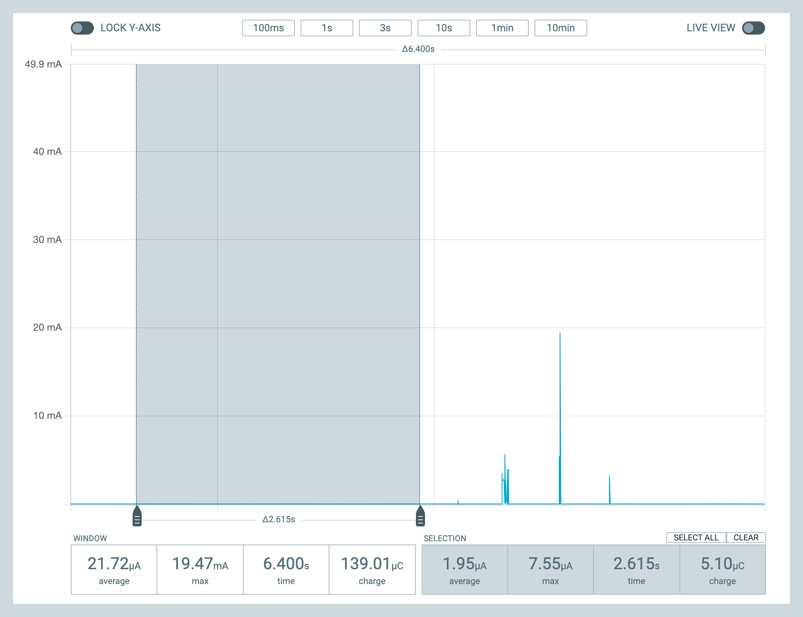
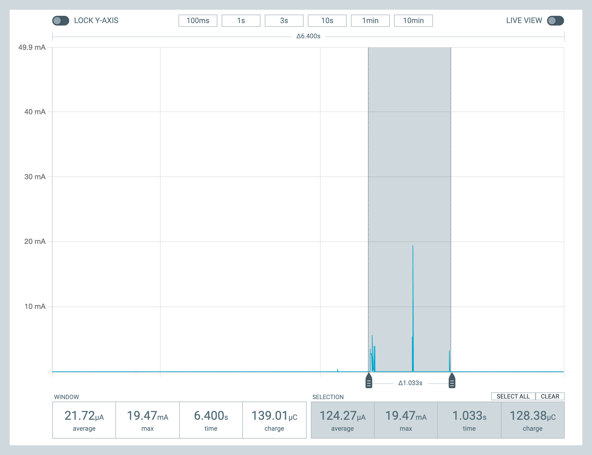

# Zigbee firmware sample
This sample is adapted from the [zigbee_template](https://developer.nordicsemi.com/nRF_Connect_SDK/doc/latest/nrf/samples/zigbee/template/README.html) from the nRF Connect SDK. It's a basic experimental/educational/exploratory firmware sample for b-parasite.

## Clusters
These [clusters](https://en.wikipedia.org/wiki/Zigbee#Cluster_library) are defined in the sample:

|Cluster ID|Name|
|--------|---|
|0x0001|Power Configuration|
|0x0400|Illuminance Measurement|
|0x0402|Temperature Measurement|
|0x0405|Relative Humidity Measurement|
|0x0408|Soil Moisture Measurement|

## Pairing Mode
The sample will first boot and start looking for a Zigbee coordinator - in pairing mode. The onboard LED will be flashing once a second while in this mode. Once a suitable network is found, the LED will briefly flash 3 times and remain off.

### Factory Reset
A factory reset will make b-parasite forget its network pairing information and switch to pairing mode. There are two (mutually exclusive) methods to perform a factory reset, controlled by the `CONFIG_PRST_ZB_FACTORY_RESET_METHOD` config flag.

#### Factory Reset Method 1 (default) - Double reset
Resetting b-parasite twice in the timestamp of 5 seconds will perform a factory reset. With this method, both shorting the `RST` pin to ground and removing-inserting the battery counts as a reset.

For better results, wait > 1 and < 5 seconds second between the resets. The LED will flash a total of 8 times to indicate it worked.

#### Factory Reset Method 2 - Reset Pin
In this method, there's a distinction between two reset modes.

#### Power up mode
The device enters this mode when it is powered. For example, swapping an old battery or connecting to eternal power. This is the "usual" reset mode, and joined networks will be remembered.

#### Reset pin mode
If the device's RESET pin is briefly grounded, the device will effectively be **factory reset**. The device will leave its previous network and start looking for a new one.

While it works, this method can be finicky - an accidental pin reset will perform an unwanted factory reset.

## Configs
Available options in `Kconfig`. Notable options:
* `CONFIG_PRST_ZB_SLEEP_DURATION_SEC`: amount of time (in seconds) the device sleeps between reading all sensors and updating its clusters
* `CONFIG_PRST_ZB_PARENT_POLL_INTERVAL_SEC`: amount of time (in seconds) the device waits between polling its parent for data

## Home Assistant Integration
This firmware sample has only been tested with Home Assistant, using one of the following integrations.

### Zigbee Home Automation (ZHA)
With the [ZHA](https://www.home-assistant.io/integrations/zha) Home Assistant integration, b-parasite should work out of the box.

### Zigbee2MQTT & Home Assistant
With [Zigbee2MQTT](https://zigbee2mqtt.io/), a custom converter is required. The [b-parasite.js](b-parasite.js) file contains such a converter. See [Support new devices](https://www.zigbee2mqtt.io/advanced/support-new-devices/01_support_new_devices.html) for instructions.

## Building

The build script lives at [`code/scripts/build.sh`](../../scripts/build.sh) and runs inside the Zephyr CI container (use [`build-with-docker.sh`](../../scripts/build-with-docker.sh) or `alias docker=podman` first).

### Selecting the regulated VDD (`REGOUT0`)

Same `CONFIG_BPARASITE_REGOUT0_*` Kconfig choice as the ble sample — see [`samples/ble/README.md`](../ble/README.md#selecting-the-regulated-vdd-regout0) for the full voltage trade-off table. Pass via `-DCONFIG_BPARASITE_REGOUT0_2V1=y` (or another value).

**Note on Zigbee radio TX power:** ZBOSS in NCS routes TX power through its own path (`zb_trans_set_tx_power()`) rather than `CONFIG_NET_L2_IEEE802154_RADIO_DFLT_TX_POWER`, so the board defconfig's `BT_CTLR_TX_PWR_*` choice doesn't reach it. Instead, `main.c` reads `CONFIG_PRSTLIB_RADIO_TX_PWR_DBM` (derived from `REGOUT0` in [`Kconfig.defconfig`](../../prstlib/boards/bparasite/Kconfig.defconfig)) and calls `zb_trans_set_tx_power()` right after `zigbee_enable()`. To override, set `CONFIG_PRSTLIB_RADIO_TX_PWR_DBM=<dBm>` in your build.

### Partition layout

NCS Zigbee NVRAM (`ncs-zigbee/subsys/osif/zb_nrf_nvram.c`) hard-includes `pm_config.h`, so unlike the other samples we can't disable Partition Manager. Instead, [`pm_static.yml`](./pm_static.yml) pins the partitions to match the Adafruit UF2 bootloader:

| Region | Range | Purpose |
|---|---|---|
| `softdevice_reserved` | 0x000000–0x026000 | MBR + SoftDevice slot (reserved, unused) |
| `app` | 0x026000–0x0EC000 | 792 KiB application image |
| `settings_storage` | 0x0EC000–0x0F4000 | 32 KiB LittleFS for ZBOSS network credentials |
| `uf2_bootloader_reserved` | 0x0F4000–0x100000 | Adafruit UF2 bootloader (don't touch) |

The build script (`scripts/build.sh`) keeps Partition Manager enabled whenever the sample ships a `pm_static.yml`. For samples without one (ble, blinky, input, soil-read-loop), `--uf2` flips PM off so the linker honours the DT `slot0_partition` offset instead.

### Production build (deploy to battery)

Default `prj.conf` settings: 60-s sleep cadence between sensor reads, 10-s parent poll interval, no console output (no USB, no UART, no RTT).

```
./scripts/build-with-docker.sh zigbee nrf52840 2.0.0ry1 --uf2 \
  -DCONFIG_BPARASITE_REGOUT0_2V1=y
```

Output: `samples/zigbee/build_nrf52840_2.0.0ry1/zigbee/zephyr/zephyr.uf2` (~825 KB).

### Development build (bring-up, logs over USB)

Applies the shared [`dev`](../../prstlib/snippets/dev/) Zephyr snippet on top of `prj.conf`:

- USB CDC ACM virtual UART → console + log destination
- `CONFIG_LOG_DEFAULT_LEVEL=4` (verbose) + `CONFIG_PRSTLIB_LOG_LEVEL_DBG=y`
- `CONFIG_PRST_ZB_SLEEP_DURATION_SEC=10` (every 10 s instead of 60 s)

```
./scripts/build-with-docker.sh zigbee nrf52840 2.0.0ry1 --uf2 --dev \
  -DCONFIG_BPARASITE_REGOUT0_2V1=y
```

Output: `samples/zigbee/build_nrf52840_2.0.0ry1_dev/zigbee/zephyr/zephyr.uf2` (~903 KB).

The dev build lives in its own `_dev` build directory, so dev and prod artifacts never overwrite each other. Don't deploy dev to battery — USB wrecks CR2032 life.

After flashing dev, find the CDC port: `ls /dev/cu.usbmodem*` (macOS) or `/dev/ttyACM*` (Linux), then `screen /dev/cu.usbmodemXXXX 115200`.

### Legacy `prj_debug.conf`

The earlier debug config at [`prj_debug.conf`](./prj_debug.conf) predates the `--dev` flag and is no longer wired into the build script. It's kept for reference — the `dev` snippet is the supported path.

## Battery Life
While sleeping, the device consumes around 2 uA:

In the active cycle, it averages around 125 uA for 1 second:

